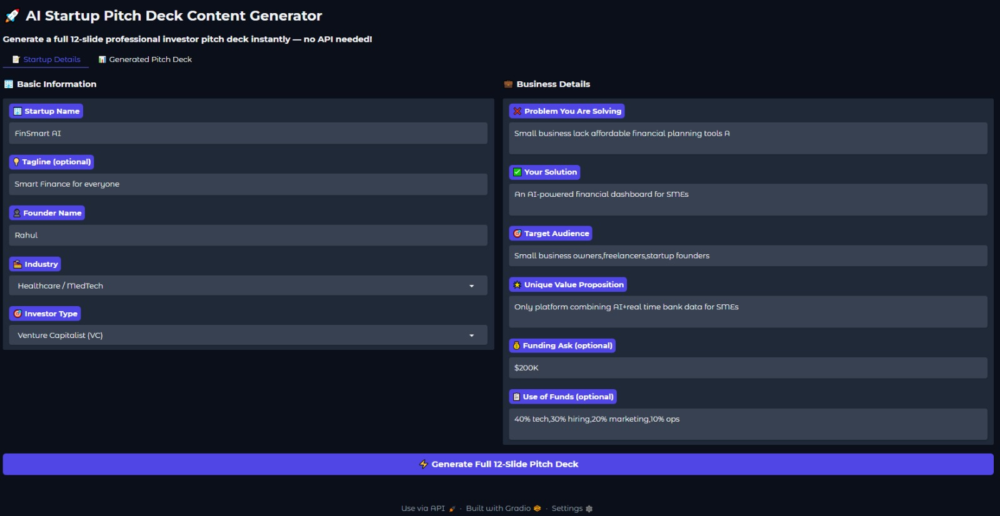
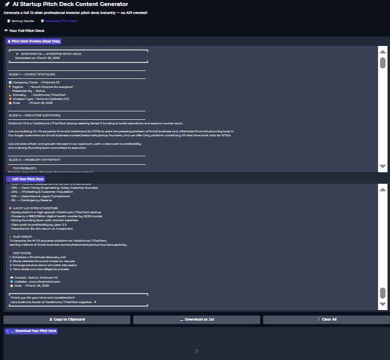

# 🚀 AI Startup Pitch Deck Content Generator

A **no-API, no-cost** tool that instantly generates a professional **12-slide investor pitch deck** for any startup — built with Python and Gradio.

---

## 🎯 What It Does

Fill in your startup details and get a fully structured, investor-ready pitch deck in seconds — covering everything from problem statement to funding ask.

---

## 🖥️ Screenshots

### Input Form


### Generated Pitch Deck


---

## 📊 Slides Generated

| # | Slide |
|---|-------|
| 1 | Cover / Title Slide |
| 2 | Executive Summary |
| 3 | Problem Statement |
| 4 | Our Solution |
| 5 | Market Opportunity |
| 6 | Competitor Analysis |
| 7 | Revenue Model & Monetization |
| 8 | Go-To-Market Strategy |
| 9 | Traction & Validation |
| 10 | Team |
| 11 | Risk Analysis & Mitigation |
| 12 | The Ask & Closing |

---

## 🏭 Supported Industries

- Tech / Software
- Healthcare / MedTech
- Finance / FinTech
- Retail / E-Commerce
- Education / EdTech
- Sustainability / GreenTech

---

## 🎯 Supported Investor Types

- Angel Investor
- Venture Capitalist (VC)
- Government Grant
- Corporate / Strategic Investor
- Crowdfunding

---

## ⚙️ Features

- ✅ No API key required — fully offline logic
- ✅ Industry-specific market data, KPIs, and competitor info
- ✅ Investor-type-aware tone and funding style
- ✅ Editable output inside the app
- ✅ Copy to clipboard
- ✅ Download as `.txt` file
- ✅ Clean Gradio UI with tabbed layout

---

## 🚀 How to Run

### Option 1 — Google Colab (Recommended)

1. Open the notebook in [Google Colab](https://colab.research.google.com/)
2. Run all cells
3. Click the generated **Gradio public link**

### Option 2 — Run Locally
```bash
# Clone the repo
git clone https://github.com/YOUR_USERNAME/AI-Startup-Pitch-Deck-Generator.git
cd AI-Startup-Pitch-Deck-Generator

# Install dependencies
pip install gradio

# Launch Jupyter
jupyter notebook AI_Startup_Pitch_Deck_Content_Generator.ipynb
```

---

## 📝 How to Use

1. Go to the **📝 Startup Details** tab
2. Fill in:
   - Startup Name, Tagline, Founder Name
   - Industry & Investor Type
   - Problem, Solution, Target Audience
   - Unique Value Proposition
   - Funding Ask & Use of Funds (optional)
3. Click **⚡ Generate Full 12-Slide Pitch Deck**
4. Switch to the **📊 Generated Pitch Deck** tab
5. Preview, edit, copy, or download your deck

---

## 🛠️ Tech Stack

| Tool | Purpose |
|------|---------|
| Python | Core logic |
| Gradio | Web UI |
| Google Colab | Cloud execution |

---

## 📦 Dependencies
```
gradio
```

Install with:
```bash
pip install gradio
```

---

## 🤝 Contributing

Pull requests are welcome! To contribute:

1. Fork the repo
2. Create a new branch (`git checkout -b feature/your-feature`)
3. Commit your changes (`git commit -m 'Add your feature'`)
4. Push to the branch (`git push origin feature/your-feature`)
5. Open a Pull Request

---

## 📄 License

This project is licensed under the **MIT License**.

---


---

⭐ If you found this useful, please **star the repo**!
